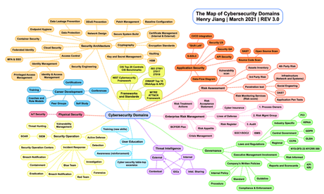

# criptografia-y-seguridad
Repositorio para la materia de criptografia y seguridada

## Integrantes
Bernal Márquez Erick

### Prácticas 

1. [Man in the middle](practicas/practica-1/practica1.pdf)
2. [Correos cifrados](practicas/practica-2/practica2.pdf)

### Tareas

1. [Máximas de Kerckhoffs](tareas/tarea-1/tarea1.pdf)
2. [Cifrados monoalfabéticos](tareas/tarea-2/tarea2.pdf)